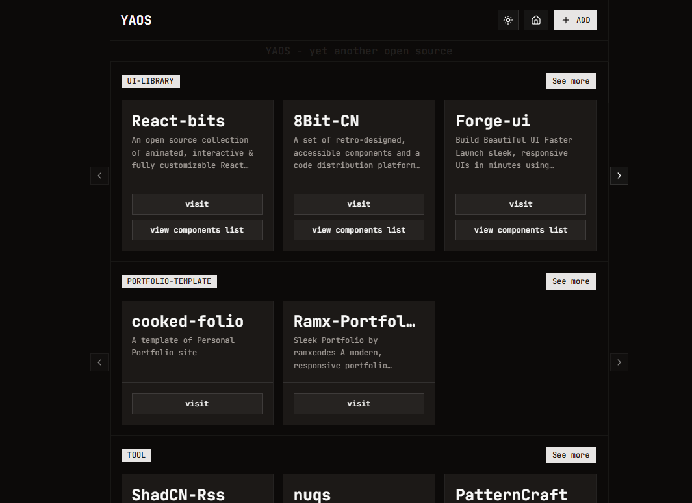

# YAOS - Yet Another Open Source

> A curated showcase of the best open source projects, UI libraries, and developer tools for your next amazing project.

> 

## What is YAOS?

YAOS is a modern, beautifully designed web platform that brings together the most valuable open source resources in one place. Whether you're building your next SaaS, portfolio, or side project, YAOS helps you discover the perfect tools and components to accelerate your development.

**Live at:** [yaos.vercel.app](https://yaos.vercel.app)

## Categories

### UI Libraries

Comprehensive collection of component libraries and design systems:

### Portfolio Templates

Professionally designed portfolio templates:

### Developer Tools

Essential tools for modern development:

### Other Projects

Unique and creative open source projects:

## Built With

- **Framework:** Next.js / React
- **Styling:** Tailwind CSS
- **Icons:** Lucide React
- **Deployment:** Vercel
- **Language:** TypeScript/JavaScript

## Contributing

We love contributions! YAOS is a community-driven project, and we welcome:

- Bug reports and fixes
- New project submissions
- Documentation improvements
- Design enhancements
- Feature suggestions

**Project Criteria:**

- Must be open source
- Active maintenance (recent commits)
- Good documentation
- Clear value proposition
- Appropriate license

## Star History

If you find YAOS useful, please consider giving it a star!

## Acknowledgments

- Thanks to all the amazing open source maintainers whose projects are featured
- Inspired by the incredible open source community
- Built with love for developers, by developers

## Contact

Have questions or suggestions? Feel free to:
- [ Reach out on Twitter/X ](https://x.com/radiumcoders)

---

**[Website](https://yaos.vercel.app)** • **[GitHub](https://github.com/radiumcoders/yaos-yet-another-opensource)**

Made with 💙 by Radium-Coders in nvim and arch btw :D
